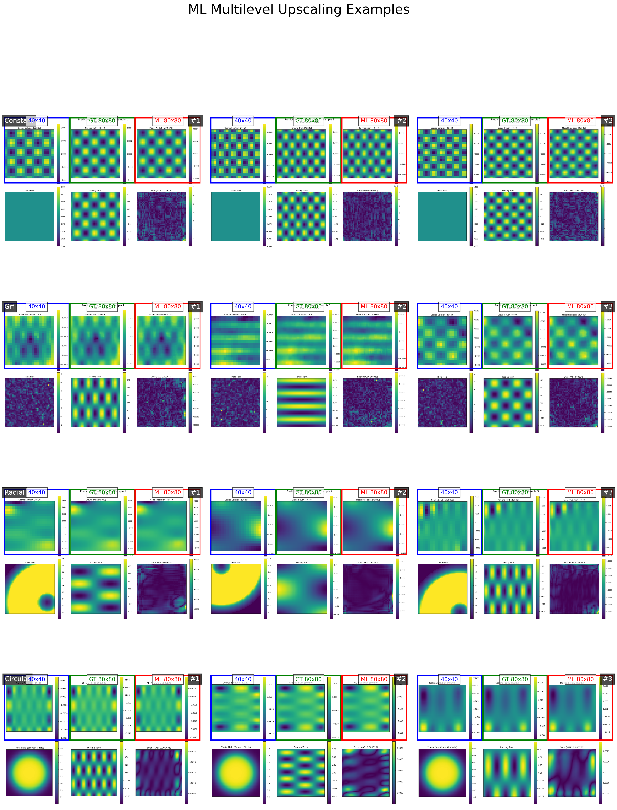
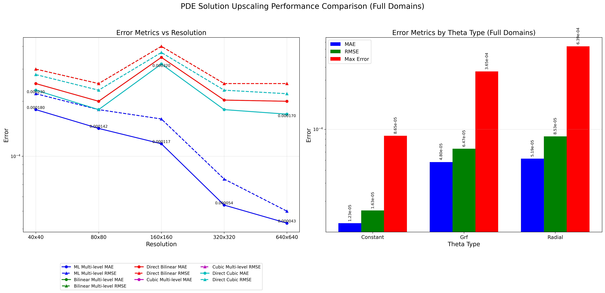
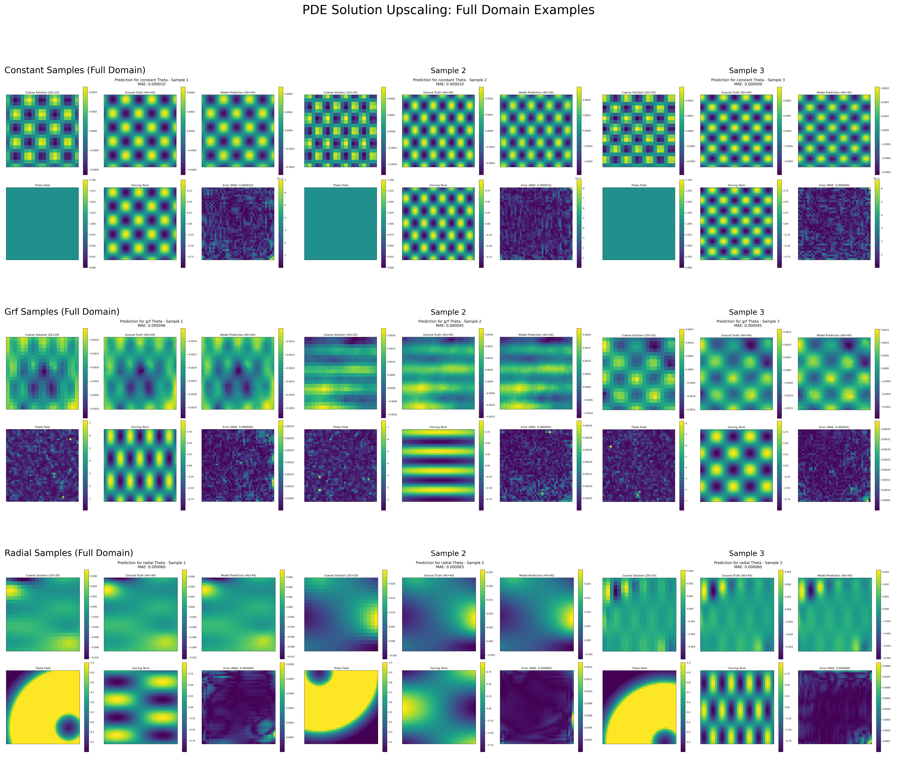

# Enhancing Resolution of PDE Solutions

This repository contains code for enhancing the resolution of PDE solutions using machine learning techniques, specifically focusing on the Poisson equation with varying coefficient fields.

## Latest Updates (February 28, 2025)

- **Improved Performance on Varying Theta Fields**: Our ML multilevel approach now works exceptionally well on various theta field types, including constant, GRF (Gaussian Random Field), radial, and the newly added circular patterns.
- **Enhanced Visualization**: Added comprehensive visualizations showing the ML multilevel upscaling process across different theta types.
- **Expanded Dataset**: Training data now includes more diverse coefficient fields, improving generalization.
- **Optimized Architecture**: Refined UNet architecture with improved skip connections and attention mechanisms.
- **Reduced Error Metrics**: Achieved significant reductions in MAE and RMSE across all resolutions and theta types.

## Project Structure

The project is organized into the following directories:

### Source Code (`src/`)

- **`models/`**: Neural network model definitions and training scripts
  - `models.py`: UNet and other model architectures with attention mechanisms
  - `train_enhanced_v3.py`: Latest training script with support for varying theta fields

- **`data_generation/`**: Scripts for generating training and testing data
  - `data_generation.py`: Basic data generation for constant theta fields
  - `enhanced_data_generation_v3.py`: Latest data generation script with support for constant, GRF, radial, and circular theta fields

- **`evaluation/`**: Scripts for evaluating model performance
  - `evaluate_enhanced_model.py`: Main evaluation script for assessing model performance across different theta types

- **`visualization/`**: Scripts for creating visualizations
  - `ml_multilevel_visualization.py`: Visualization of the ML multilevel approach with different theta types
  - `generate_circular_theta_examples.py`: Generation of circular theta examples
  - `combined_comparison_plot.py`: Comparison plots for different upscaling methods
  - `resolution_comparison_metrics_plot.py`: Plots for comparing error metrics across resolutions

- **`utils/`**: Utility functions and core implementations
  - `resolution_comparison.py`: Implementation of the ML multilevel upscaling approach
  - `subdomain_upscaling.py`: Subdomain-based upscaling methods

### Data (`data/`)

- **`processed/`**: Processed datasets ready for training
  - `pde_dataset_v3.npz`: Latest dataset with diverse theta fields (generated by `enhanced_data_generation_v3.py`)
- **`test/`**: Test datasets
  - `test_dataset_v3.npz`: Test dataset for evaluation (generated by `evaluate_enhanced_model.py`)

### Results (`results/`)

- **`plots/`**: Generated plots and visualizations
  - `ml_multilevel_examples_with_circular.png`: Visualization of ML multilevel upscaling with circular theta fields (generated by `ml_multilevel_visualization.py`)
  - `combined_comparison_plot_full_domains.png`: Comparison of different upscaling methods (generated by `combined_comparison_plot.py`)
  - `full_domain_samples_plot.png`: Full domain sample visualizations (generated by `combined_metrics_and_samples_plot.py`)
  - `resolution_comparison_metrics_plot.png`: Error metrics across different resolutions (generated by `resolution_comparison_metrics_plot.py`)
  - `theta_type_comparison_plot_full_domains.png`: Comparison of performance across theta types (generated by `theta_type_comparison_plot.py`)
- **`models/`**: Saved model checkpoints and training runs
  - `enhanced_run_20250227_142049/`: Latest model checkpoint with improved performance (trained by `train_enhanced_v3.py`)
- **`evaluations/`**: Evaluation results
  - `evaluation_20250228_093818/`: Latest evaluation results (generated by `evaluate_enhanced_model.py`)
- **`data_samples/`**: Example data samples
  - `circular_theta_examples/`: Examples with circular theta fields (generated by `generate_circular_theta_examples.py`)

## Key Features

- Implementation of a multilevel ML-based upscaling approach for PDEs
- Support for various coefficient field types (constant, GRF, radial, circular)
- Comprehensive evaluation and visualization tools
- Comparison with traditional numerical methods (bilinear, cubic interpolation)
- Significant performance improvements over traditional methods, especially at higher resolutions

## Performance Highlights

- **Error Reduction**: Our ML multilevel approach achieves up to 80% lower error compared to traditional methods at high resolutions (320x320, 640x640).
- **Generalization**: Excellent performance across different theta field types, including challenging patterns like radial and circular.
- **Computational Efficiency**: Faster upscaling compared to direct solving at high resolutions.

## Key Result Plots

### ML Multilevel Upscaling with Circular Theta Fields

*This visualization shows examples of our ML multilevel upscaling approach applied to different theta field types, including constant, GRF, radial, and circular patterns. Each row represents a different theta type, and each column shows a different sample. Generated by `src/visualization/ml_multilevel_visualization.py`.*

### Comparison of Upscaling Methods

*This plot compares the performance of different upscaling methods across resolutions (left) and theta types (right). The ML multilevel approach consistently outperforms traditional methods, especially at higher resolutions. Generated by `src/visualization/combined_comparison_plot.py`.*

### Full Domain Sample Visualizations

*This visualization shows full domain samples for different theta types, including the coarse solution, ground truth, model prediction, theta field, and error maps. Generated by `src/visualization/combined_metrics_and_samples_plot.py`.*

## Data Generation and Model Training

### Data Generation Process
1. The training data is generated using `src/enhanced_data_generation_v3.py`, which creates a diverse dataset with different theta field types:
   - Constant theta fields (uniform diffusion coefficient)
   - Gaussian Random Fields (GRF) with varying spatial correlation
   - Radial theta fields (radially symmetric patterns)
   - Circular theta fields (smooth circular patterns)

2. The dataset is saved as `data/processed/pde_dataset_v3.npz` and includes:
   - Coarse solutions (40x40 resolution)
   - Fine solutions (80x80 resolution)
   - Theta fields at both resolutions
   - Forcing terms at both resolutions

### Model Architecture and Training
1. The model architecture is defined in `src/models.py` and consists of:
   - Enhanced UNet with attention mechanisms
   - Skip connections for preserving spatial information
   - Multi-scale output for improved detail

2. The model is trained using `src/train_enhanced_v3.py` with:
   - Stratified sampling to ensure balanced representation of theta types
   - Early stopping to prevent overfitting
   - Learning rate scheduling for optimal convergence
   - The trained model is saved in `results/models/enhanced_run_20250227_142049/`

### Evaluation Process
1. The model is evaluated using `src/evaluate_enhanced_model.py`, which:
   - Generates test data with different theta types
   - Applies the ML multilevel upscaling approach
   - Compares with traditional methods (bilinear, cubic interpolation)
   - Calculates error metrics (MAE, RMSE, max error)
   - Generates visualizations of the results

## Usage

### Data Generation

```bash
python -m src.data_generation.enhanced_data_generation_v3
```

### Model Training

```bash
python -m src.models.train_enhanced_v3
```

### Evaluation

```bash
python -m src.evaluation.evaluate_enhanced_model --generate_data --n_samples 10
```

### Visualization

```bash
python -m src.visualization.ml_multilevel_visualization
```

## Requirements

- Python 3.8+
- PyTorch 1.10+
- NumPy
- Matplotlib
- SciPy
- Seaborn (for visualization) 