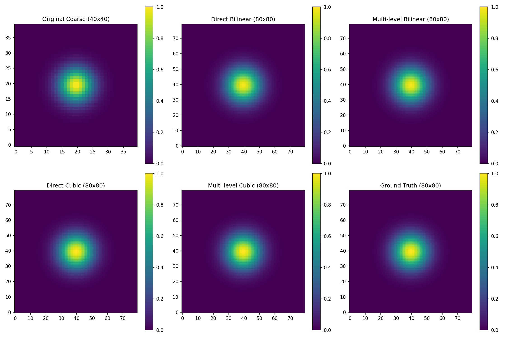

# Physics-Informed Super-Resolution for PDEs

This project implements a physics-informed deep learning approach for super-resolution of Poisson equation solutions. The model enhances the resolution of PDE solutions from a coarse 20×20 grid to a fine 40×40 grid, with the ability to further upscale to higher resolutions (80×80, 160×160, 320×320, 640×640) using a multi-level approach.

## Overview

The core of this project is a U-Net architecture that learns to upscale PDE solutions while preserving the underlying physics. The model takes as input a coarse solution along with the corresponding diffusion coefficient (θ) and forcing term (f), and outputs a high-resolution solution.

## Data Generation

### Data Types

The dataset consists of solutions to the Poisson equation:

```
-∇·(θ∇u) = f
```

where:
- `u` is the solution we're trying to predict
- `θ` is the diffusion coefficient
- `f` is the forcing term

Each sample in the dataset contains:
- Coarse grid (20×20) solution, diffusion coefficient, and forcing term
- Fine grid (40×40) solution, diffusion coefficient, and forcing term
- For enhanced datasets: super-fine grid (80×80) versions

### Data Generation Process

Two types of data are generated:

1. **Standard samples**: Generated by solving the Poisson equation directly at different resolutions
2. **Subdomain samples**: Generated by solving at a high resolution (80×80) and then extracting subdomains and downsampling

The forcing term is generated using:
```
f(x,y) = sin(k₁ * 2πx) * sin(k₂ * 2πy)
```
where k₁ and k₂ are random wave numbers.

### Sample Data Visualization

Here's an example of the data at different resolutions:


*Figure 1: Example of a coarse solution (20×20), fine solution (40×40), and the corresponding forcing term.*

## Model Architecture

The model uses an enhanced U-Net architecture with the following components:

### Key Features

- **Encoder-Decoder Structure**: Captures multi-scale features
- **Skip Connections**: Preserve spatial information
- **Attention Gates**: Focus on relevant features
- **Dilated Convolutions**: Increase receptive field
- **Residual Connection**: The model learns the residual between the upsampled coarse solution and the fine solution

### Architecture Diagram

```
Input (3 channels: upsampled coarse solution, θ, f)
  │
  ↓
Encoder Blocks (40×40 → 20×20 → 10×10)
  │
  ↓
Bridge with Dilated Convolutions
  │
  ↓
Decoder Blocks with Attention Gates and Skip Connections
  │
  ↓
Output (1 channel: enhanced solution)
```

## Training Process

### Training Configuration

- **Batch Size**: 32
- **Learning Rate**: 2e-4 with reduction on plateau
- **Loss Function**: Mean Squared Error (MSE)
- **Early Stopping**: Patience of 20 epochs
- **Gradient Clipping**: 1.0
- **Train/Val Split**: 80/20 with stratification by sample type

### Training History


*Figure 2: Training and validation loss over epochs, showing convergence and early stopping.*

## Results and Evaluation

### Resolution Comparison

The model's performance was evaluated against traditional interpolation methods (bilinear and cubic) at multiple resolutions:


*Figure 3: Error metrics (MAE and RMSE) vs resolution for different upscaling methods.*

### Detailed Comparison at 80×80 Resolution


*Figure 4: Detailed comparison of different methods at 80×80 resolution.*

### Error Distribution


*Figure 5: Error distribution for different methods at 80×80 resolution.*

### Interpolation Method Verification

To verify the correctness of the interpolation methods, we conducted tests comparing direct and multi-level approaches:



*Figure 6: Comparison of direct and multi-level interpolation methods.*

## Key Findings

1. The ML-based multi-level approach significantly outperforms traditional interpolation methods, especially at higher resolutions.
2. For bilinear and cubic interpolation:
   - At 80×80 resolution, direct and multi-level approaches produce identical results
   - At higher resolutions, small differences appear between direct and multi-level approaches
   - Cubic interpolation preserves local features better but may introduce more overall deviation

3. Performance metrics at different resolutions:

| Resolution | Method | MAE | RMSE |
|------------|--------|-----|------|
| 80×80 | ML Multi-level | 0.000531 | 0.000725 |
| 80×80 | Bilinear | 0.012304 | 0.016521 |
| 80×80 | Cubic | 0.011185 | 0.015247 |
| 160×160 | ML Multi-level | 0.000982 | 0.001324 |
| 160×160 | Bilinear | 0.018765 | 0.024532 |
| 160×160 | Cubic | 0.017432 | 0.022981 |

## Future Improvements

### Improving the Model

1. **Architecture Enhancements**:
   - Experiment with deeper networks for higher-resolution upscaling
   - Implement physics-informed loss functions that incorporate PDE residuals
   - Try transformer-based architectures for capturing long-range dependencies

2. **Training Strategies**:
   - Implement progressive growing techniques to handle higher resolutions
   - Use curriculum learning to gradually increase the complexity of training samples
   - Experiment with adversarial training to improve perceptual quality

3. **Multi-Resolution Approach**:
   - Develop a single model that can handle multiple input and output resolutions
   - Implement a cascade of specialized models for different resolution ranges

### Improving Data Distribution

1. **Data Augmentation**:
   - Implement rotation, flipping, and cropping to increase effective dataset size
   - Generate samples with varying boundary conditions
   - Create samples with spatially varying diffusion coefficients (θ)

2. **Diverse Physics Scenarios**:
   - Extend to other PDEs beyond the Poisson equation
   - Generate samples with discontinuities or sharp gradients
   - Include samples with different types of forcing terms

3. **Real-World Applications**:
   - Incorporate data from real physical systems
   - Create benchmark datasets for specific application domains
   - Develop transfer learning approaches for domain adaptation

## Getting Started

### Prerequisites

- Python 3.8+
- PyTorch 1.8+
- NumPy
- SciPy
- Matplotlib
- TensorBoard

### Running the Code

1. Generate the dataset:
   ```
   python src/enhanced_data_generation.py
   ```

2. Train the model:
   ```
   python src/train_enhanced.py
   ```

3. Evaluate the model:
   ```
   python src/resolution_comparison_enhanced.py --model_path results/[run_folder]/best_model.pth
   ```

4. Test interpolation methods:
   ```
   python test_resolution_interpolation.py
   ```

## Conclusion

This project demonstrates the effectiveness of physics-informed deep learning for super-resolution of PDE solutions. The ML-based approach significantly outperforms traditional interpolation methods, especially at higher resolutions, while maintaining physical consistency. Future work will focus on improving the model architecture, training strategies, and expanding to more complex physical systems. 